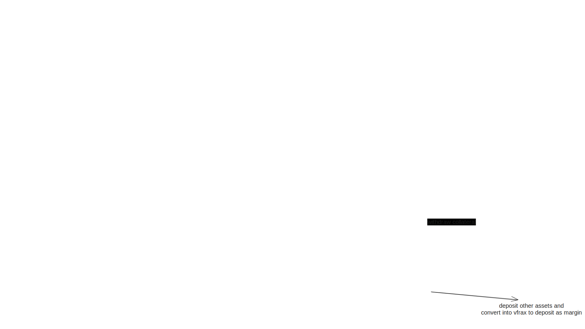

Product Road Map

- Architecture and Technical Specifications (github latex maths probably)
- Start work on smart contracts (Fuzz test and invariants instead of unit to save time)
- Start iterating app design
- Launch testnet
- Audits and security
- Mainnet launch
- offchain trading engine in rust/python(EIP 712 Order matching)
- Test coverage (-%)

## Smart contracts Architecture

 
Perma is coming as the go-to perp trading app for DeFi newbies. Think of it as trading on a CEX, but you’re actually in the DeFi world. It’s about making everything seamless as possible , simple and technical at the same time

## Pricing models for mark price and Funding rates

### Funding Rate formula

Mark Price is calculated as the sum of the Index Price and a 30-period Moving Average (MA30). The MA30 is computed based on the difference between the mid-price of the current order book and the Index Price. Specifically:

Mark Price = Index Price + MA30 MA30 = 30-period Moving Average of [(Bid1 + Ask1) / 2 - Index Price]

Where Bid1 is the highest buy order price And Ask1 is the lowest sell order price

The Mark Price is recalculated each time there's a change in either the highest bid (Bid1) or the lowest ask (Ask1) price in the order book. This ensures that the Mark Price remains responsive to real-time market conditions while also accounting for short-term price trends through the moving average component.

$MP(t)$: Mark Price at time $t$ $IP(t)$: Index Price at time $t$ $B_1(t)$: Highest bid price at time $t$ $A_1(t)$: Lowest ask price at time $t$ $\Delta(t)$: Difference between mid-price and Index Price at time $t$

Then:

Mid-price calculation: $M(t) = \frac{B_1(t) + A_1(t)}{2}$ Difference from Index Price: $\Delta(t) = M(t) - IP(t)$ Moving Average calculation: $MA_{30}(t) = \frac{1}{30} \sum_{i=0}^{29} \Delta(t-i)$ Mark Price calculation: $MP(t) = IP(t) + MA_{30}(t)$ Update condition: $MP(t)$ is recalculated whenever $B_1(t) \neq B_1(t-\varepsilon)$ or $A_1(t) \neq A_1(t-\varepsilon)$

In concise notation: $MP(t) = IP(t) + \frac{1}{30} \sum_{i=0}^{29} \left[\frac{B_1(t-i) + A_1(t-i)}{2} - IP(t-i)\right]$ Subject to: $\forall \varepsilon > 0$, if $B_1(t) \neq B_1(t-\varepsilon)$ or $A_1(t) \neq A_1(t-\varepsilon)$, then recalculate $MP(t)$

### Funding Rate formula

- $F$ = Funding Rate
- $P$ = Premium Index
- $I$ = Interest Rate
- $\text{max}_F$ = Maximum value (around 1%)
- $\text{min}_F$ = Minimum value (around -1%)

$$F = \text{Clamp} \left( P + \text{Clamp} \left( I - P, -0.0005, 0.0005 \right), \text{max}_F, \text{min}_F \right)$$

Here, the `Clamp` function can be expressed as:

$$
\text{Clamp}(x, \text{min}, \text{max}) = \begin{cases}
\text{min} & \text{if } x < \text{min} \\
\text{max} & \text{if } x > \text{max} \\
x & \text{otherwise}
\end{cases}
$$

Breaking this down:

1. **Inner Clamp**:

$$
\text{Clamp}(I - P, -0.0005, 0.0005) = \begin{cases}
-0.0005 & \text{if } I - P < -0.0005 \\
0.0005 & \text{if } I - P > 0.0005 \\
I - P & \text{otherwise}
\end{cases}
$$

2. **Adding to P**:

$$P + \text{Clamp}(I - P, -0.0005, 0.0005)$$

3. **Outer Clamp**:

$$F = \text{Clamp} \left( P + \text{Clamp} \left( I - P, -0.0005, 0.0005 \right), 0.01, -0.01 \right)$$

Where:

$$
\text{Clamp}(x, -0.01, 0.01) = \begin{cases}
-0.01 & \text{if } x < -0.01 \\
0.01 & \text{if } x > 0.01 \\
x & \text{otherwise}
\end{cases}
$$

$$
F = \begin{cases}
-0.01 & \text{if } P + \begin{cases}
-0.0005 & \text{if } I - P < -0.0005 \\
0.0005 & \text{if } I - P > 0.0005 \\
I - P & \text{otherwise}
\end{cases} < -0.01 \\
0.01 & \text{if } P + \begin{cases}
-0.0005 & \text{if } I - P < -0.0005 \\
0.0005 & \text{if } I - P > 0.0005 \\
I - P & \text{otherwise}
\end{cases} > 0.01 \\
P + \begin{cases}
-0.0005 & \text{if } I - P < -0.0005 \\
0.0005 & \text{if } I - P > 0.0005 \\
I - P & \text{otherwise}
\end{cases} & \text{otherwise}
\end{cases}
$$
